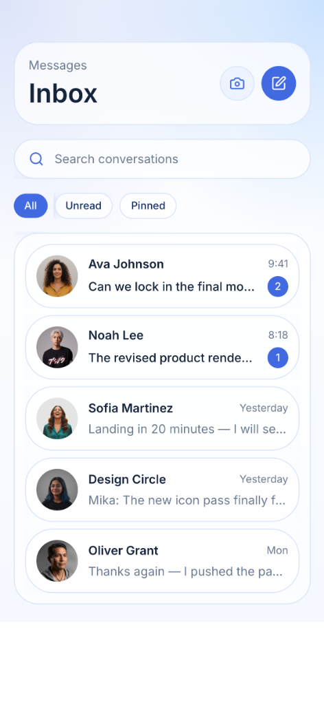
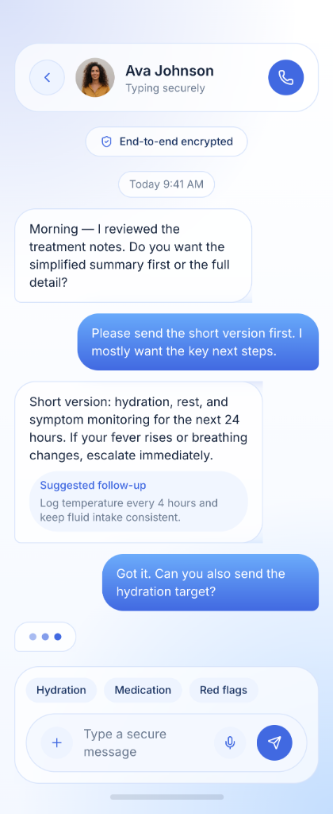
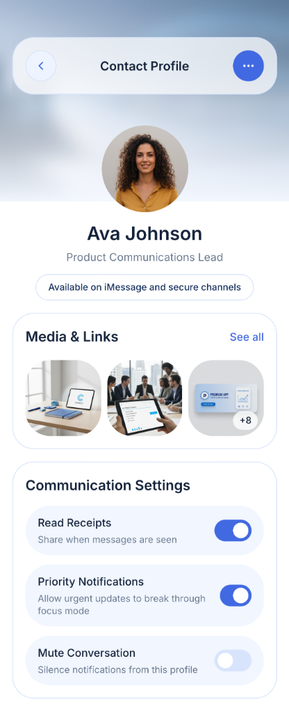

# 💬 SwiftUI Chat

**Secure. Native. Fast.**

SwiftUI Chat is a high-fidelity messaging application built with native SwiftUI. It features a sophisticated iOS-style design system with BackdropFilter blur effects, end-to-end encryption indicators, and AI-powered conversation assists.

## 📸 Screenshots

  
  
  

## ✨ Features

- 🔒 **End-to-End Encryption** — Visible security indicators for safe, private conversations.
- 🧊 **Native iOS Design** — Built using modern SwiftUI patterns, featuring native blur effects and typography.
- 🤖 **AI Suggestions** — Smart follow-up recommendations and quick-reply chips integrated into the chat flow.
- 📸 **Rich Media Sharing** — Polished contact profiles with integrated media and link galleries.
- ⚡ **High Performance** — Lightweight, responsive messaging interface optimized for the latest iOS devices.

## 🛠️ Tech Stack

- **Framework**: SwiftUI
- **Architecture**: MVVM
- **Security**: End-to-End Encryption (E2EE)
- **UI Components**: SF Symbols, NavigationStack
