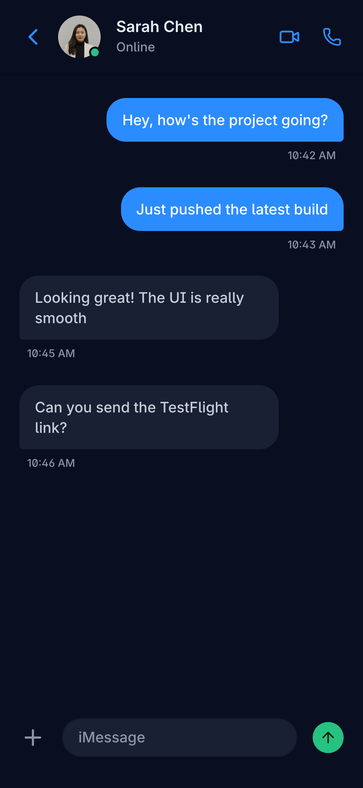

# 💬 SwiftChat — Real-Time Messaging for iOS

> A modern, production-ready chat application built with **SwiftUI** featuring real-time messaging, push notifications, and end-to-end encryption.


<p align="center">
  
  
  
</p>

---

## ✨ Features

- 💬 **Real-Time Messaging** — WebSocket-powered instant message delivery
- 📷 **Rich Media** — Send photos, videos, voice messages, and files
- 🔐 **End-to-End Encryption** — Messages encrypted using CryptoKit
- 🔔 **Push Notifications** — APNs integration for background delivery
- 👥 **Group Chats** — Create and manage group conversations
- 📸 **Camera Integration** — Built-in camera with AVFoundation
- 🎨 **Custom Themes** — Personalize chat backgrounds and colors
- 🔍 **Message Search** — Full-text search across all conversations
- ✅ **Read Receipts** — Delivered, read, and typing indicators
- 🌙 **Dark Mode** — Adaptive UI with seamless dark mode support
- 📱 **Haptic Feedback** — Tactile responses for key interactions
- 🗑️ **Swipe Actions** — Archive, delete, pin conversations

---

## 🏗️ Architecture

Built with **Clean Architecture + MVVM** for maximum testability and maintainability:

```
SwiftChat/
├── Sources/
│   ├── App/
│   │   └── SwiftChatApp.swift
│   ├── Models/
│   │   ├── Message.swift              # Message entity
│   │   ├── Conversation.swift         # Conversation model
│   │   ├── User.swift                 # User profile
│   │   └── MediaAttachment.swift      # File attachments
│   ├── ViewModels/
│   │   ├── ConversationListVM.swift   # Conversation list logic
│   │   ├── ChatViewModel.swift        # Individual chat logic
│   │   ├── AuthViewModel.swift        # Authentication flow
│   │   └── ProfileViewModel.swift     # Profile management
│   ├── Views/
│   │   ├── ConversationListView.swift # Main conversation list
│   │   ├── ChatView.swift             # Chat message view
│   │   ├── MessageBubbleView.swift    # Message bubble component
│   │   ├── MediaPickerView.swift      # Photo/video picker
│   │   └── ProfileView.swift          # User profile
│   ├── Services/
│   │   ├── WebSocketService.swift     # Real-time connection
│   │   ├── MessageService.swift       # Message CRUD
│   │   ├── AuthService.swift          # JWT authentication
│   │   ├── MediaService.swift         # File upload/download
│   │   └── EncryptionService.swift    # E2E encryption
│   └── Network/
│       ├── APIClient.swift            # URLSession networking
│       ├── Endpoints.swift            # API endpoint definitions
│       └── NetworkMonitor.swift       # Connectivity monitoring
├── SwiftChatTests/
│   ├── WebSocketServiceTests.swift
│   ├── MessageServiceTests.swift
│   └── EncryptionServiceTests.swift
└── Resources/
    └── Assets.xcassets
```

---

## 🛠️ Tech Stack

| Technology | Purpose |
|-----------|---------|
| **Swift 5.9** | Primary language with async/await |
| **SwiftUI 5** | Declarative UI with new Observable macro |
| **WebSocket** | URLSessionWebSocketTask for real-time |
| **CryptoKit** | End-to-end message encryption |
| **AVFoundation** | Camera and audio recording |
| **PhotosUI** | PHPicker for media selection |
| **Core Data** | Offline message caching |
| **APNs** | Push notification delivery |
| **Combine** | Reactive event handling |
| **XCTest** | Unit and integration testing |

---

## 🔐 Security

- **AES-GCM encryption** for messages using CryptoKit
- **Keychain** storage for encryption keys
- **Certificate pinning** for API communication
- **Biometric lock** with Face ID / Touch ID

---

## 🚀 Quick Start

```bash
git clone https://github.com/Adonias-hibeste/swiftui-chat-app.git
cd swiftui-chat-app
open SwiftChat.xcodeproj
# Configure your server URL in Config.swift
# Build and run (⌘ + R)
```

### Server Requirements
The app connects to a WebSocket server. A sample Node.js server is included in `/server` for development.

---

## 📱 Figma Design

The UI was designed in **Figma** following Apple HIG guidelines. Key design decisions:
- Bubble-style messages with dynamic sizing
- Glassmorphism for navigation elements
- Contextual haptic feedback for message actions
- Smooth keyboard-aware scroll behavior

---

## 📄 License

MIT License — see [LICENSE](LICENSE) for details.

## 👨‍💻 Author

**Adonias Hibeste** — Senior Mobile Architect  
[Portfolio](https://adonias-portfolio.vercel.app) · [LinkedIn](https://linkedin.com/in/adonias-hibeste) · [GitHub](https://github.com/Adonias-hibeste)
